# Class tools for Moodle (Oksigenia Classtools)

[](LICENSE)


[](https://oksigenia.com/en/open-source#sponsor)

Board tools for the classroom, **with the course students already loaded and their photos**. Open them from any
course, put them on the classroom screen and the whole class plays along: a name picker that is fair over the
weeks, random groups that can become course groups, a scoreboard, chance tools and whole-class games.

https://github.com/user-attachments/assets/eb6fe1a4-66fb-4d34-bb6d-4b03407691c2

Local plugin (`local_oksigeniaclasstools`). It works with any theme and needs no external service: no CDN, no
tracking, no build step.

[Leer en español](README.es.md)

## From early years to university

Each course picks one of four screen modes. The mode changes the look and how the tools start (bigger buttons and
colours for the youngest, the full board and sober screens for the older ones), never which tools there are.

The students in these screenshots do not exist: their names are made up and their photos were generated.

### Early years

*Reception · Bears*: big buttons, bright colours and nothing to read.

| Timer with the disc look, readable from the back of the room | Score: «Twinkle, Twinkle, Little Star» on the glockenspiel |
|---|---|
| 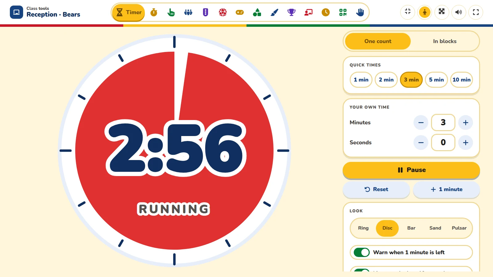 | 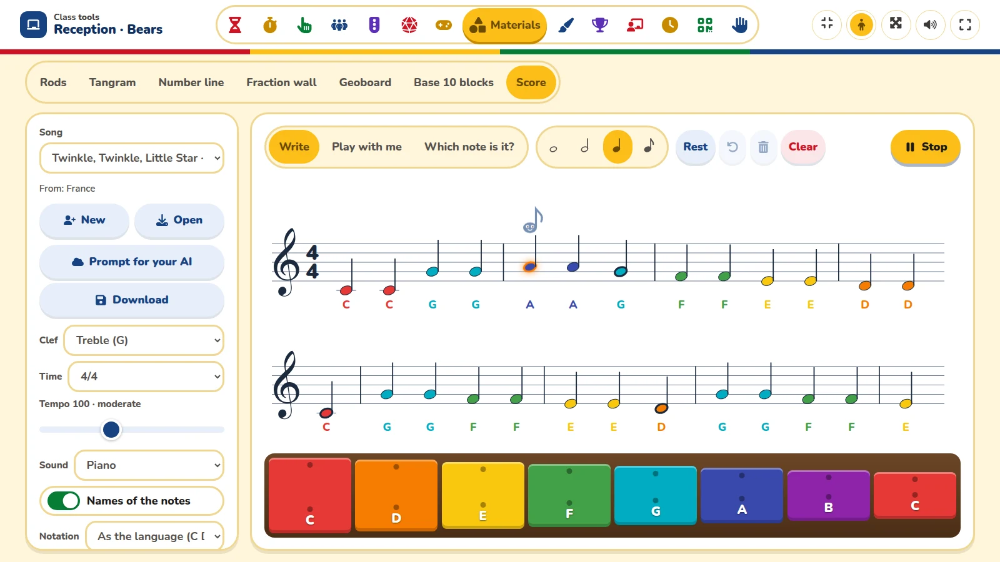 |
| **Tangram with guide lines; the pieces snap together** | **Learning to tell the time, with the hands dragged by a finger** |
| 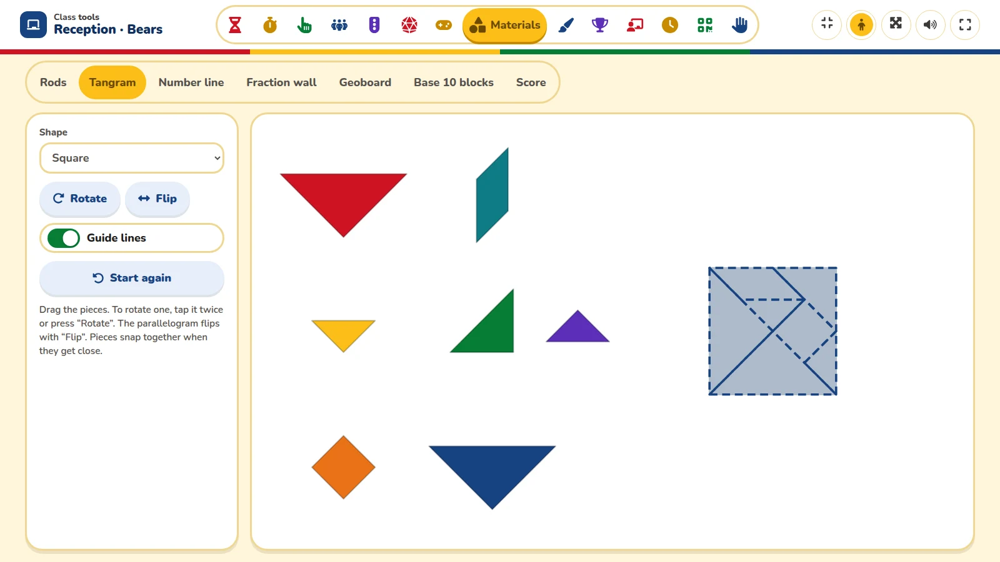 | 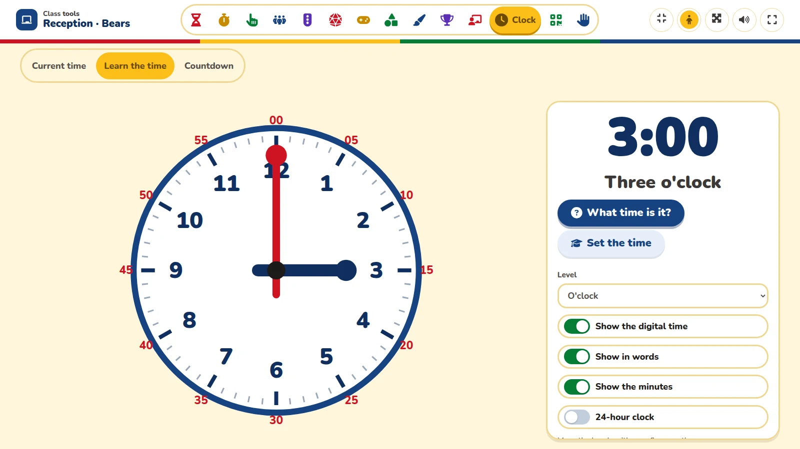 |

### Primary

*Year 5 · Science*: the class list of the course, with photos.

| Name picker, fair over the weeks | Random groups with a role for each one |
|---|---|
| 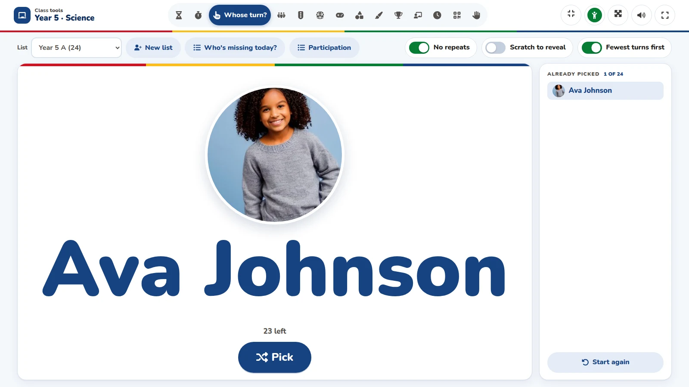 | 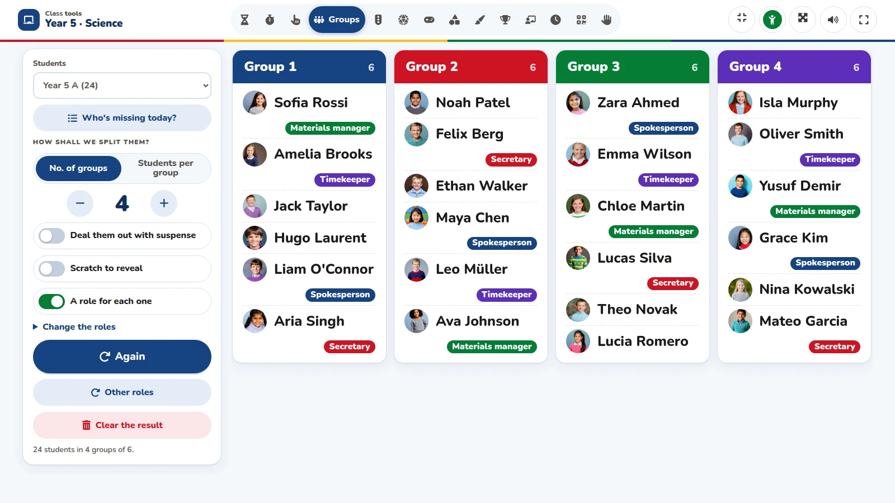 |
| **Live quiz: the class joins with a QR code, and questions can have pictures** | **Fraction wall** |
| 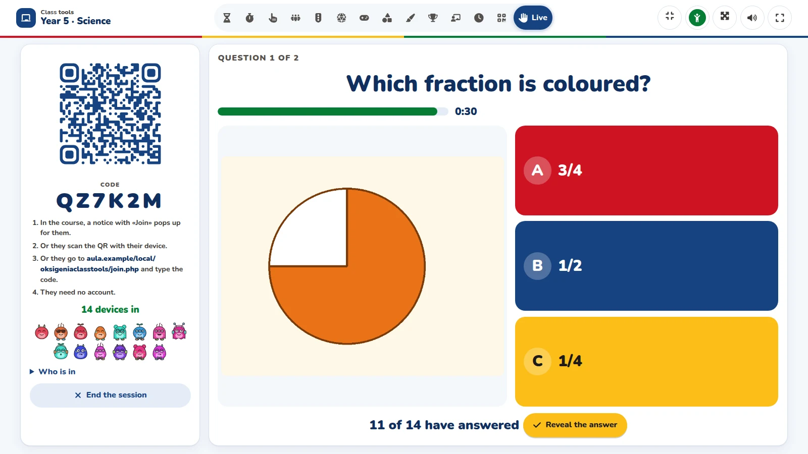 | 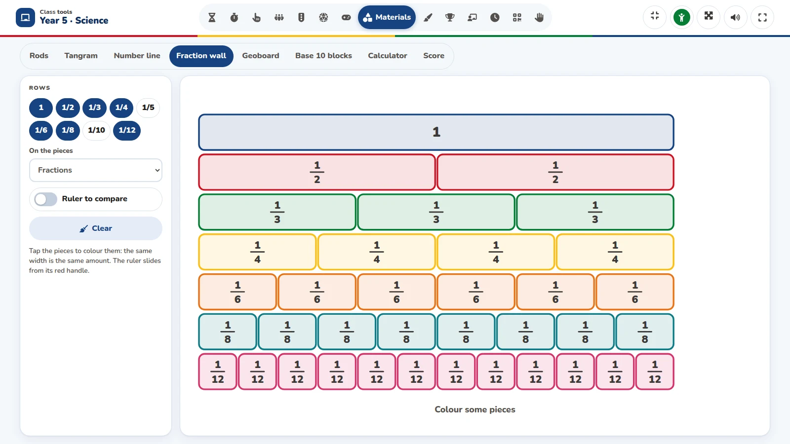 |

### Secondary

*Year 9 · Maths*: the full board and the class's own answers.

| Full board: formulas, a magic triangle, ruler and protractor | Brainstorm: the answers become a live word cloud | Scientific calculator with its history |
|---|---|---|
| 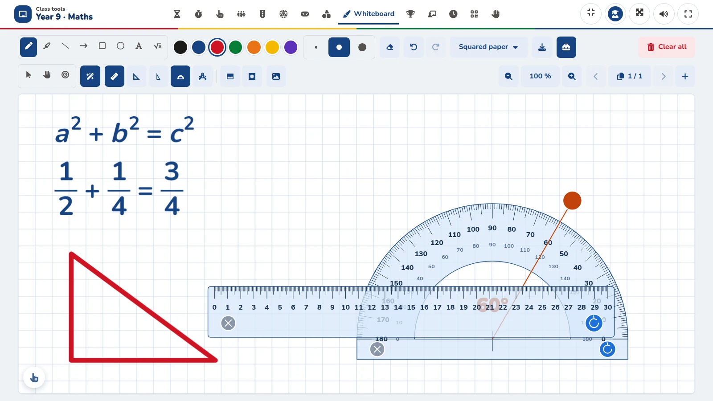 | 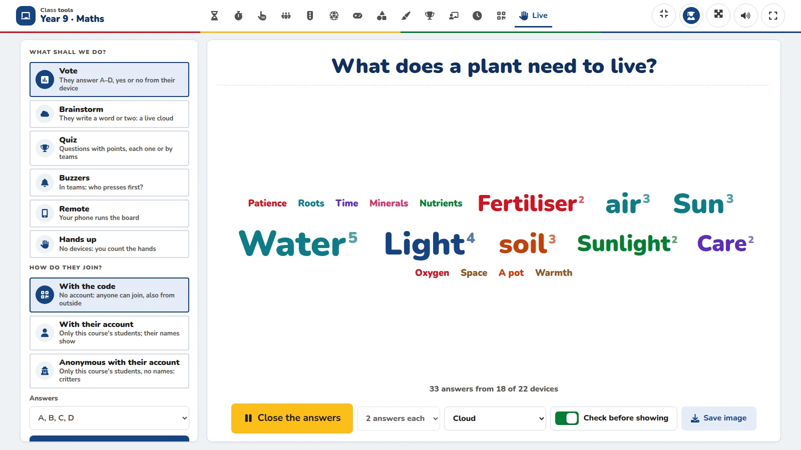 | 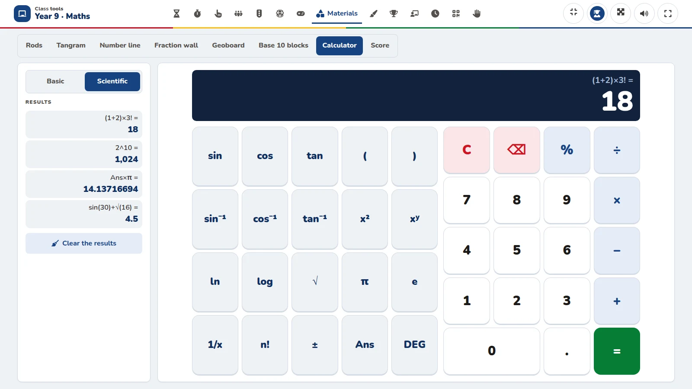 |

### Advanced

*Physics · Year 12* (upper secondary and university): sober, with no confetti.

| Formulas written in one line and drawn as in a book | Vote from the phones, with the results as bars | Countdown to the exams, with the school days left |
|---|---|---|
| 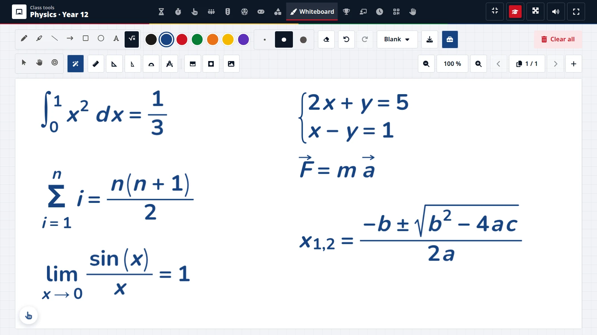 | 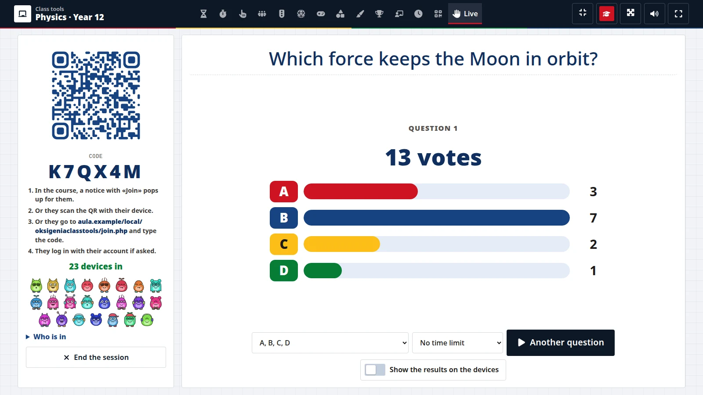 | 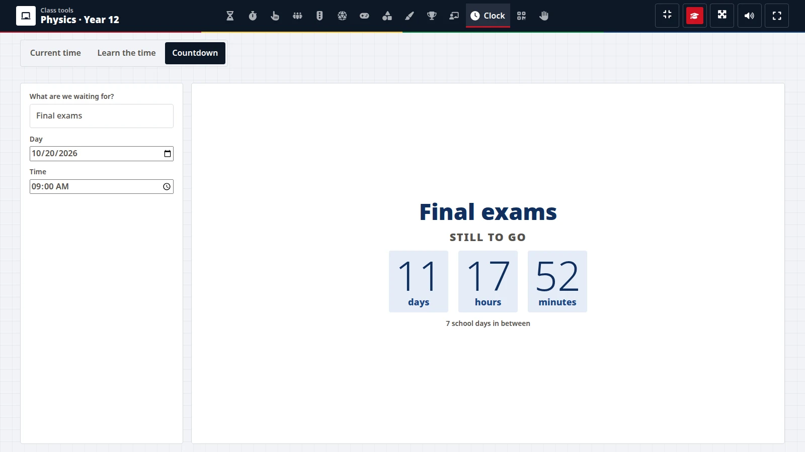 |

## What's inside

| Tool | What it does |
|---|---|
| Timer and stopwatch | Big, readable from the back of the room, with sound and five looks. **Work and rest blocks** (a pomodoro for the class), a notice with a minute left, the last ten seconds to count aloud, and a small timer in a corner while another tool is in front. |
| Name picker | Pick a student with their photo. No repeats until everyone has been picked, and **fair picking**: whoever has been picked least in the last weeks comes first (with any teacher of the course). «Participation» shows the counts; «scratch to reveal» if wanted. The same picker sends someone **to the board or to the glockenspiel** from those tools. |
| Who is missing today | Tap absent students and they are left out of picks and groups for the day. |
| Groups | Random groups with faces, a role for each one, reordered by dragging. Optionally **saved as course groups** (only when the teacher asks). |
| Scoreboard and class goal | 2 to 8 teams, big buttons, the leader crowned; or a jar that fills with marbles towards a goal of the whole class. Kept in Moodle, so it goes on from any computer. |
| Chance | Configurable wheel (students, own lists, numbers), dice (4 to 20 faces, operations, directions, colours, letters, custom), coins with motifs, and cards. |
| Games | Rosco (letter ring with clues; whole class or two teams), Simon (turns with the class list), Hangman (with balloons), Word (like Wordle), Pairs (built-in sets by school level) and Secret code (an escape-room lock with clues). |
| Materials | Cuisenaire rods, tangram, number line, fraction wall, geoboard, base-10 blocks, a **calculator** (basic in Primary, scientific from Secondary) and a **score**: treble or bass clef, notes written with a tap, played with sounds made in the browser (piano, glockenspiel, recorder…), «play with me» on a glockenspiel, a note game, traditional songs of many countries, and songs brought in as text or ABC (with a prompt for an AI). |
| Drawing board | The **simple board**: pens, highlighter, shapes, text, eraser, undo, backgrounds (squared paper, handwriting lines, music staves; white, green or black), several fingers at once. The **full board** adds pages with thumbnails kept in the course, a picture or a PDF as background, selecting and moving what is drawn, zoom, a laser pointer, **magic shapes** (a shaky line becomes a straight one), **formulas** written in one line and drawn as in a book, and the **ruler, set squares, protractor and compass**, the curtain and the spotlight. PNG download, or **shared with a class** (saved in the course, the students get a notification). |
| Live sessions | The class joins from tablets or phones with a **QR code or a code** (no account needed, also for people outside Moodle) or with their Moodle account, by name or anonymous. **Vote**, team **buzzers**, the teacher's phone as a **remote**, a **brainstorm** (short answers that become a live word cloud, or sorted into templates such as SWOT or urgent/important) and a **quiz** (one right answer or true/false, calm or fast scoring, teams from the groups, a ranking that need not point at the last ones, pictures, questions written, pasted or from the course question bank). Students enrolled in the course get a notice with «Join». |
| Clock | The time now, **learning to tell the time** (hands dragged with a finger, digits and words, five levels and two class games) and a **countdown** to an event with the school days left. |
| Noise meter | Microphone level only (nothing is recorded or sent). A light that breathes with the noise, a calm streak, a patience reserve that only sustained noise uses up, and «adjust to this class». |
| Also | Work symbols and a QR code with styles, the site logo in the middle and PNG/SVG download. |
| Screen modes | Early years, Primary, Secondary or Advanced: one at a time, per course. They change the look and the defaults (bigger notes and colours for the youngest, the full board for the older ones…), never which tools there are. «Names in capitals», in the same menu, shows the students' names in capitals (on by default in Early years). |

Lists come from the course: one per group and one per cohort enrolled with cohort sync, and the whole course. A
group and a cohort with the same students appear once. Separate groups mode is respected.

## Requirements

- Moodle 4.3 or later, tested on 4.3, 5.2, 5.3 and 6.0dev. From 4.4 the links go in the course bar and the main menu
  (navigation hooks). In 4.3 the link shows in the course's «More» menu, and the main-menu link is not available:
  admins can add it as a custom menu item (`/local/oksigeniaclasstools/index.php`). Moodle 4.1 and 4.2 cannot hold
  the plugin's table names, which are longer than 28 characters.
- PHP as required by your Moodle.
- Any theme. A modern browser.

## Install

### From ZIP

1. Download the latest release ZIP from the Releases page.
2. In Moodle: *Site administration → Plugins → Install plugins → Choose file* and pick the ZIP.
3. Confirm the install. Moodle creates four tables (picks, kept tools, live sessions and their answers).

### From Git

```bash
cd /path/to/moodle/public/local/
git clone https://github.com/OksigeniaSL/moodle-local_oksigeniaclasstools.git oksigeniaclasstools
```

Then visit *Site administration → Notifications* to finish the install.

## Who decides what

**Site administrator** — *Site administration → Plugins → Local plugins → Class tools (Oksigenia Classtools)*:

| Setting | Default | Notes |
|---|---|---|
| Name on the board | First name and first surname | Or first name only, or full name. |
| Days counted for fair picking | 90 | Also the period shown in «Participation». |
| Screen mode by default | Primary | Early years, Primary, Secondary or Advanced (upper secondary and university). One at a time; teachers change it per course. |
| School levels | All | Early years, primary, secondary, upper secondary, higher education: the built-in sets offered by the games. |
| Tools, Games and Materials | All | Which tools, games and materials appear on the board. New ones are added to the choice when the plugin is upgraded. |
| Notice for students | On | While a live session is open, its students see «Join» on the course pages. |
| Open the board to students | Off | Students get only the tools without data of the class (games, materials, drawing board, timer, clock, QR): never names, photos, picks or groups, and nothing of theirs is saved. |
| Link in the main menu | On | Inside each course the link is always in the course bar. |

**Roles** — capability `local/oksigeniaclasstools:use` (teacher, non-editing teacher and manager by default)
opens the tools with the students of a course. Saving teams as course groups also needs
`moodle/course:managegroups`.

**Teachers** — inside each tool: their own lists, roscos, locks, quizzes, songs and board pages, and the options of
each game. Lists pasted by hand and «who is missing today» stay in their browser; the scoreboard, roscos, locks,
quizzes, songs and board pages are also kept in Moodle for the teacher in the course, so they go on from any
computer. Pictures and PDFs put on the board stay in the browser where they were added.

## User tour

On install (or upgrade to 0.7.0) the plugin adds a user tour for teachers. It shows once per teacher, points at the
link in the course bar and in the main menu, and says what is inside. Its texts are language strings. It can be
edited or switched off in *Site administration → Appearance → User tours*.

## Privacy

Four tables and one file area, all covered by the privacy provider (export and deletion) and removed with their
course or user:

- `local_oksigeniaclasstools_picks`: each time a student is picked (course, student, teacher, time). Deleted every
  night once older than the days counted for fair picking.
- `local_oksigeniaclasstools_state`: what each teacher keeps of each tool in each course.
- `local_oksigeniaclasstools_live` and `local_oksigeniaclasstools_livein`: live sessions (who opened them and when)
  and the answers of each device. With the code only, a device is a random token; anonymous with an account, a
  token from which the user cannot be known, and no user id is kept; by name, the user id. Deleted after a day.
- The pictures of quiz questions, in the course for the teacher who put them; those that no quiz uses are deleted
  a day later.

No external services, no CDN and no tracking: everything the board needs comes with the plugin.

## Status and roadmap

Beta, developed with a school in Tenerife as its test classroom. Before the first stable release:

- **Languages**: the board's texts come from the language packs (English and Spanish, others through AMOS), and the
  built-in content (alphabet, keyboard, words, pair sets, the time in words, examples) from a content pack per
  language in `app/content/` (English, Spanish, Spanish of Mexico, German, French, Italian, Dutch, Swedish and
  Portuguese of Brazil). Next: the interface strings for those languages in AMOS.
- **Site configuration**: which tools and games are shown, the default Hangman drawing, and site-wide lists, roscos
  and locks shared by all teachers. Built-in examples become neutral and per language.
- **Code**: the board scripts move to AMD modules. `moodle-plugin-ci` (PHPUnit and Behat on Moodle 4.3 to 5.3) runs
  in GitHub Actions.

## Development

The board screen lives in `app/` and is also packaged as a standalone SCORM 1.2 package. `./build.sh` builds the
installable ZIP in `dist/`. The component name `local_oksigeniaclasstools` never changes, so each release installs
over the previous one and keeps its data.

## License

GNU GPL v3 or later. © 2026 Oksigenia. Third-party parts are listed in `thirdpartylibs.xml`: the QR generator
(MIT), the Nunito font (SIL OFL 1.1, `app/fonts/OFL.txt`), Font Awesome Free icons (CC BY 4.0) and PDF.js (Apache
2.0, loaded only to bring a PDF onto the board). The treble clef of the score is a public domain drawing from
Wikimedia Commons; the songs that come with it are traditional or in the public domain. Ideas for the full board
come from OpenBoard (GPL 3), written anew.
